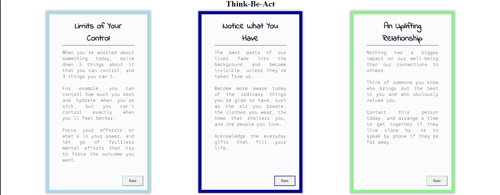

## Be Think Act

Users can click through different seriers of cards that are meant to provoke some self-inquiry throughout the day.

**Link to project:** [Be-Think-Act](https://be-think-act.vercel.app/)

## How It's Made:

**Tech used:** React, SASS

Built using React and SASS to make the css a bit less painful. Made very good use of custom react components and JS methods like filter and map.

## Lessons Learned:

Learnt about the power of using components and advanced javascript methods to dynamically create many pieces of the UI. I also came to understand why databases and API's are such powerful tools.
